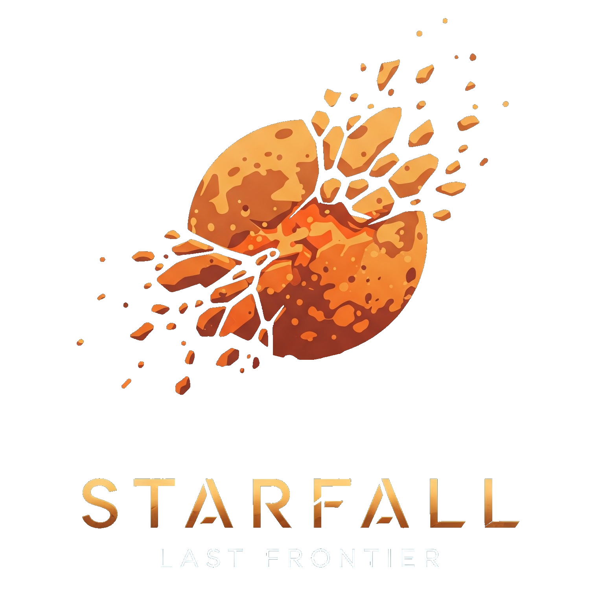

# Starfall: Last Frontier

  

Bienvenue dans **Starfall: Last Frontier**, un jeu de survie spatial intense où vous incarnez un pilote solitaire, traversant les confins d’un univers en ruine. Choisissez votre vaisseau, équipez-vous d’un puissant module d’amélioration et préparez-vous à affronter les dangers de l’espace !

---

## 🚀 Histoire

La galaxie autrefois prospère est en train de sombrer dans le chaos. Des tempêtes cosmiques, des astéroïdes et d’anciennes machines de guerre errantes menacent d’anéantir toute vie restante. En tant que pilote, votre mission est simple : **survivre, explorer et repousser les limites de l’espace connu.**

---

## 🎮 Comment jouer ?

1. **Choisissez votre vaisseau** : Chaque vaisseau a des caractéristiques uniques.
2. **Sélectionnez un power-up** : Activez des améliorations spéciales pour vous aider.
3. **Lancez la partie** : Évitez les obstacles, survivez aux vagues d’ennemis et tentez d’établir un nouveau record !

---

## 🛸 Vaisseaux disponibles

Chaque vaisseau possède ses propres forces et faiblesses. Sélectionnez celui qui correspond le mieux à votre style de jeu.

| Vaisseau | Vitesse 🚀 | Accélération ⚡ | Santé ❤️ |
|----------|-----------|----------------|----------|
| **Striker**  | ⭐⭐⭐⭐ | ⭐⭐ | ⭐⭐⭐ |
| **Sentinel**  | ⭐⭐ | ⭐⭐⭐ | ⭐⭐⭐⭐ |
| **Phantom**  | ⭐⭐⭐ | ⭐⭐⭐⭐ | ⭐ |

*(Ajoutez une brève description pour chaque vaisseau ici.)*

---

## 🔥 Power-ups

Choisissez un power-up avant chaque partie pour renforcer votre vaisseau.

| Power-up | Effet |
|----------|-------|
| **Droid Repair**  | Répare lentement votre vaisseau en cours de partie. |
| **Boost Overdrive**  | Augmente temporairement la vitesse et l’accélération. |
| **Shield Generator**  | Ajoute un bouclier protecteur contre un impact. |

*(Ajoutez des descriptions plus détaillées si nécessaire.)*

---

## 🌌 Cartes disponibles

L’environnement dans lequel vous jouez influence fortement la difficulté et les mécaniques de jeu. Chaque carte est unique !

### **Ring of Ruin**  
  
Une planète rouge-orangée entourée d’un anneau de débris en perpétuel mouvement. Les collisions sont fréquentes, et la visibilité réduite.

### **Moonfall Nexus**  
  
Une planète bleue avec sa lune, traversée par de puissantes tempêtes cosmiques. Attention aux courants gravitationnels !

### **Void Drift**  
  
Une zone instable remplie d’astéroïdes et d’une supernova en explosion. Seuls les pilotes les plus habiles peuvent survivre ici.

*(Ajoutez ici des détails sur les effets et les dangers de chaque carte.)*

---

## 🎮 Commandes

Les commandes sont simples mais demandent une bonne maîtrise pour éviter les obstacles et optimiser vos déplacements.

| Action | Touche |
|--------|--------|
| **Se déplacer à gauche** | ← (Flèche gauche) |
| **Se déplacer à droite** | → (Flèche droite) |
| **Utiliser le boost** | Espace |
| **Activer le power-up** | Majuscule gauche (Shift) |

*(Ajoutez ici des commandes spécifiques si nécessaires.)*

---

## 🏆 Objectif

Votre but est d’aller aussi loin que possible tout en accumulant des points en évitant les obstacles et en survivant aux vagues d’ennemis. Atteindrez-vous le sommet du classement ?

---

## 🔥 Prêt à jouer ?

Appuyez sur **JOUER** et préparez-vous à une aventure spatiale palpitante !

